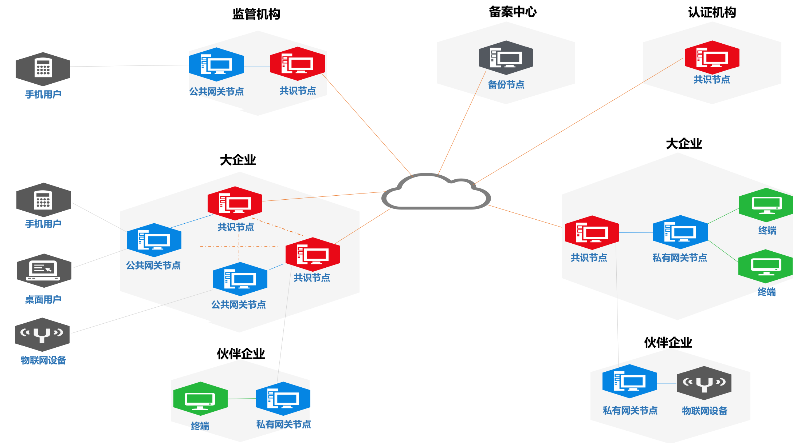

[TOC]
#JD区块链 0.5.0-SNAPSHOT

------------------------------------------------------------------------
### 版本修订历史
<table>
        <tr>
            <th>版本号</th>
            <th>作  者</th>
            <th>修改日期</th>
            <th>备  注</th>
        </tr>
        <tr>
            <td>0.0.6</td>
            <td>黄海泉</td>
            <td>2017-11-10</td>
            <td>
              定义JD区块链项目的目标与关键能力；<br>
              定义JD区块链的核心对象模型；<br>
              定义“账户”的生成算法和“区块/交易/操作/账户”的关键属性；<br>
              描述了编程接口的示例代码；
            </td>
        </tr>
        <tr>
            <td>0.0.7</td>
            <td>黄海泉</td>
            <td>2017-11-17</td>
            <td>
              丰富了对“节点共识”、“节点分区”两项关键能力的详细描述；
            </td>
        </tr>
        <tr>
            <td>0.0.8</td>
            <td>黄海泉</td>
            <td>2018-07-17</td>
            <td>
              增加部署图；增加智能合约开发的示例；
            </td>
        </tr>
</table>

------------------------------------------------------------------------

## 一、概述
JD区块链项目的目标是提供一个面向广泛的应用场景、满足企业核心需求的灵活和易用的区块链系统。
以下是 JD 区块链用以满足企业核心需求的关键能力，也是显著区别于其它区块链的重要特征：

 - 快速共识
 - 节点分区
 - 并行多账本
 - 大数据伸缩存储
 - 条件检索
 - 面向对象的合约代码编程模型
 - 节点快速部署
 - 多终端灵活接入
 - 分布式自治的账户权限管理模型

JD区块链对于关键能力的定义是建立在深入理解和抽象各种多样化需求的基础上的。

 - 快速共识（Efficient Consensus）
	 我们认为，“快速”不仅仅体现在“用更短时间”达成共识，还要体现在交易（Transaction）要得到可靠地执行。
	 需要在算法和实现层面做出保障，确保所有提交的合法的交易会被系统在一个“确定性”和“足够短”的时间之内被严格地执行，系统不主动作出随机性地丢弃（不包括系统故障因素）。注：POW类算法产生的链分叉处理是一种系统随机性地丢弃交易的行为。
	 从使用者的视角来看，这种能力就是区块链系统的“可靠性”，这对于企业、金融场景而言尤其重要。
	 
 - 节点分区（Peer Partition）
	 “分区”是一种分布式系统架构原则，通过将大范围目标按照某种相似特征分隔为一个个小范围目标，分别进行更高效地处理，这能从整体上提升整个系统的处理能力。
	 区块链系统也是一种分布式系统，沿用“分区”的思想这点来自以往的系统架构实践的经验，是有可能让区块链系统获得可媲美现有系统的处理能力。这种能力将可以无障碍地把区块链在应用于广泛的企业场景中。
	 在此，我们所说的“节点分区（Peer Partition）” 是共识过程中的物理通讯层面的分区，在共识过程中只有相关的物理节点才会建立通讯链路并复制和存储共识的状态数据。在一个区块链系统中，可以从节点全集中选择一个或多个节点子集，分别组成一个或多个节点分区（Peer Partition）
	 
 - 并行多账本
	 账本（Ledger）
 - 大数据伸缩存储
 - 条件检索
 - 面向对象的合约代码编程模型
 - 节点快速部署
 - 多终端灵活接入
 - 分布式自治的账户权限管理模型

## 二、对象模型
JD区块链的核心对象包括：

 - 账本（Ledger）
	一份账本（Ledger）实质上是由两部分组成：
	- 一组以“账户（Account）”表示的状态数据；
	- 以“区块的链条（Block-chain）”表示的状态数据的变更历史；
	
	JD区块链的“账本（Ledger）”是一个最顶层的管理数据的逻辑单元。在一个区块链节点构成的共识网络中，可以维护多套并行的“账本（Ledger）”。
	
 - 账户（Account）
	 - 在JD区块链中，账户（Account）被设计为包含“身份（Identity）”、“权限（Privilege）”、“状态（State）”、“控制规则（Control Rule）” 这4种属性的对象。
	 - 其中，“身份（Identity）”、“权限（Privilege）”这两种属性是一个面向应用的系统的基本功能；
	 - “状态（State）”、“控制规则（Control Rule）” 这两种属性这是一个具备“图灵完备性”的系统的基本属性，使系统可以处理任意多样化的任务；
	 - 在这里，“身份（Identity）”是一个抽象表述，其形式上就是一个“区块链地址（Address）”和相应的“非对称秘钥钥对（KeyPair）”/证书。  简单来说，一个“账户（Account）”就是一个区块链地址、公私钥对以及一套的权限配置.
	 - 一个“账户（Account）”的“状态（State）”、“控制规则（Control Rule）” 这2种属性则是可选的，这提供了不同于其它区块链的账户/合约的一种新的使用方式，即一种数据和逻辑分离的应用设计思路（这在传统的web应用编程中被称为“贫血模型”）。同时，也意味着一个特定“账户”中的数据状态是可以跨账户/合约代码进行共享访问的。
	 - 从应用的视角来看，对“账户”的使用方式可以有几种模式：
		 - 用于表示业务角色/用户：
		 - 用于表示业务数据：仅有“状态（State）”没有“控制规则（Control Rule）”的账户，可称为数据账户，就有些类似于关系数据库中的“表（Table）”的作用，不同业务类别的数据则使用不同的账户来管理。
		 - 用于表示业务逻辑：仅有“控制规则（Control Rule）”没有“状态（State）”的账户，即所谓的合约账户，可表示某种用于处理数据的通用逻辑，可被授权访问特定的数据账户。

 - 区块（Block）
	在概念上，与通常所说的区块的概念是一致的。
	在实现上，一个区块的主要内容是包含了某一时刻提交的所有交易以及交易执行之后的状态数据的快照的hash，而不存储具体的交易操作和状态数据。

 - 交易（Transaction）
	在概念上，与通常所说的Transaction的概念是一致的，表示一组需要原子执行的操作。
	
 - 操作（Operation）
	操作是针对“账户（Account）”的“写”指令，包括以下几类：
	- 注册账户
	- 更新账户的状态数据
	- 更新账户的合约代码定义
	- 调用账户的合约代码
	
 - 合约代码（Contract Code）
 合约代码是一段用于对“账户（Account）”的状态数据执行操作的代码程序。

## 三、部署模型

 1. 总体部署

 
 2. 系统组件
 - 共识节点
 - 复制节点
 - SDK
 - 网关
 - 终端
 
 3. 配置和管理

## 四、账本结构

### 1. 账户生成算法

 - 公私钥对
	 - 算法：默认ED25519 ，支持 SM2、CA；
	 - 公钥存储格式：版本 + 算法标识 + 公私钥原始内容 + 校验码
	 - 字符编码方式：Base64
 - 地址
	 - 算法
		 - 给定公钥 P （或由私钥 R 算出公钥 P）
		 - 中间值 H1 = SHA256( P )
		 - 中间值 H2 = RIPEMD-160( H1 )
		 - 中间值 X = 版本 + 公钥算法标识 + H2
		 - 校验和 C = 前4字节( SHA256( SHA256( X )) )
		 - 地址 Address = Base58( X + C )
			 
### 2. 区块	
<table>
        <tr>
            <th>属性</th>
            <th>名称</th>
            <th>说明</th>
        </tr>
         <tr>
            <td>BlockHash</td>
            <td>当前区块 hash</td>
            <td>对区块中除此之外的其它所有属性一起进行哈希运算生成</td>
        </tr>
        <tr>
            <td>BlockVersion </td>
            <td>区块版本</td>
            <td>表示区块-交易的属性结构的版本号；</td>
        </tr>
        <tr>
            <td>PreviousBlockHash</td>
            <td>上一区块 hash</td>
            <td></td>
        </tr>
        <tr>
            <td>BlockNumber</td>
            <td>区块高度</td>
            <td>区块高度是一个区块在链中的序号；<br>创始区块的高度为 0，每个新区块的高度依次递增；</td>
        </tr>
        <tr>
            <td>AccountHash</td>
            <td>账户树hash</td>
            <td>账户的 Merkle Tree 根的 hash</td>
        </tr>
        <tr>
            <td>AccountCount</td>
            <td>账户数量</td>
            <td>区块生成时账本中的全部账户的总数</td>
        </tr>
        <tr>
            <td>TxTreeHash</td>
            <td>交易树 hash</td>
            <td>本区块的交易集合的 Merkle Tree 根的 hash</td>
        </tr>
        <tr>
            <td>TxCount</td>
            <td>区块交易数量</td>
            <td>当前区块包含的交易的数量；</td>
        </tr>
        <tr>
            <td>TxTotalCount</td>
            <td>账本交易总数</td>
            <td>截止到当前区块为止当前账本的所有交易的总数量；</td>
        </tr>
        <tr>
            <td>CloseTime</td>
            <td>区块关闭时间</td>
            <td>生成当前区块时的区块链节点的网络时间；</td>
        </tr>
</table>

### 3. 交易	
<table>
        <tr>
            <th>属性</th>
            <th>名称</th>
            <th>说明</th>
        </tr>
         <tr>
            <td>Hash</td>
            <td>当前交易 hash</td>
            <td>对交易中除此之外的其它所有属性一起进行哈希运算生成</td>
        </tr>
        <tr>
            <td>LedgerNumber</td>
            <td>区块高度</td>
            <td>交易被包含的区块高度</td>
        </tr>
        <tr>
            <td>BlobHash</td>
            <td>交易数据块hash</td>
            <td>交易的数据块是交易的原始数据，包含客户端提交的交易的全部操作及其参数； 
            <br>交易的参与者需要使用私钥对交易数据块进行签名；</td>
        </tr>
        <tr>
            <td>Operations</td>
            <td>操作列表</td>
            <td>交易的操作列表；</td>
        </tr>
        <tr>
            <td>Sponsor</td>
            <td>交易发起人</td>
            <td>交易发起人的账户地址；</td>
        </tr>
        <tr>
            <td>SequenceNumber</td>
            <td>交易序号</td>
            <td>交易序号记录了一个特定的发起人的交易的顺序号，等同于该发起人历史上发起的交易的总数；</td>
        </tr>
        <tr>
            <td>Signatures</td>
            <td>签名列表</td>
            <td>由交易发起人和其它参与者对交易数据块的签名的列表；</td>
        </tr>
        <tr>
            <td>Result</td>
            <td>交易结果</td>
            <td>0 - 表示执行成功；非零表示执行失败；<br>注：最终的账本只包含成功的交易;</td>
        </tr>
</table>

### 4. 操作	
<table>
        <tr>
            <th>属性</th>
            <th>名称</th>
            <th>说明</th>
        </tr>
         <tr>
            <td>OpType</td>
            <td>操作类型</td>
            <td>
		         一级操作类型包括：注册账户、配置权限、写入键值数据、写入对象数据、定义合约代码、调用合约代码；<br>
		         “键值数据写入”操作的子操作类型包括：填入键值、移除键、数值增加、数值减少；<br>
		         “对象数据写入”操作的自操作类型包括：插入对象、更新对象、移除对象；
			</td>
        </tr>
        <tr>
            <td>Args</td>
            <td>参数列表</td>
            <td>与操作类型相对应的参数列表；</td>
        </tr>
        <tr>
            <td>SubOps</td>
            <td>子操作列表</td>
            <td>“子操作”是“操作”的递归定义，由“操作类型”来标识；</td>
        </tr>
</table>

### 5. 账户	
<table>
        <tr>
            <th>属性</th>
            <th>名称</th>
            <th>说明</th>
        </tr>
         <tr>
            <td>Address</td>
            <td>地址</td>
            <td>账户的唯一标识</td>
        </tr>
        <tr>
            <td>RegNumber</td>
            <td>注册号</td>
            <td>账户被注册到区块链的区块高度；</td>
        </tr>
        <tr>
            <td>TxSquenceNumber</td>
            <td>交易序列号</td>
            <td>由账户发起的交易的序列号，初始为 0，账户每发起一个交易则增加1；</td>
        </tr>
        <tr>
            <td>ModelVersion</td>
            <td>账户模型版本</td>
            <td>表示构成一个账户结构的属性模型的程序版本号；</td>
        </tr>
        <tr>
            <td>Version</td>
            <td>账户版本</td>
            <td>初始为 0，对账户的每一次变更(包括对权限设置、状态和合约代码的变更)都会使账户状态版本增加 1 ；<br>注：交易序号的改变不会导致账户版本的增加；</td>
        </tr>
        <tr>
            <td>PrivilegeHash</td>
            <td>权限 hash</td>
            <td>权限树的根hash；</td>
        </tr>
        <tr>
            <td>PrivilegeVersion</td>
            <td>权限版本</td>
            <td>初始为 0， 每次对权限的变更都导致版本号加 1；</td>
        </tr>
        <tr>
            <td>StateType</td>
            <td>状态类型</td>
            <td>账户的状态类型有3种：空类型(NIL)；键值类型；对象类型；</td>
        </tr>
        <tr>
            <td>StateVersion</td>
            <td>状态版本</td>
            <td>账户的状态类型有3种：空类型(NIL)；键值类型；对象类型；</td>
        </tr>
        <tr>
            <td>StateHash</td>
            <td>状态哈希</td>
            <td>数据状态的 merkle tree 的根hash；</td>
        </tr>
        <tr>
            <td>CodeHash</td>
            <td>合约代码哈希</td>
            <td>由“账户地址+合约代码版本号+合约代码内容”生成的哈希；</td>
        </tr>
        <tr>
            <td>CodeVersion</td>
            <td>代码版本</td>
            <td>初始为 0，每次对代码的变更都使版本加 1 ；</td>
        </tr>
</table>

## 五、编程接口

### 1. 服务连接


```java
    //创建服务代理
    public static BlockchainKeyPair CLIENT_CERT = BlockchainKeyGenerator.getInstance().generate();
    final String GATEWAY_IP = "127.0.0.1";
    final int GATEWAY_PORT = 80;
    final boolean SECURE = false;
    GatewayServiceFactory serviceFactory = GatewayServiceFactory.connect(GATEWAY_IP, GATEWAY_PORT, SECURE,
    		CLIENT_CERT);
    // 创建服务代理；
    BlockchainService service = serviceFactory.getBlockchainService();
```


### 2. 账户注册


```java
    // 创建服务代理；
    BlockchainService service = serviceFactory.getBlockchainService();
    // 在本地定义注册账号的 TX；
    TransactionTemplate txTemp = service.newTransaction(ledgerHash);		
    SignatureFunction signatureFunction = asymmetricCryptography.getSignatureFunction(CryptoAlgorithm.ED25519);
    CryptoKeyPair cryptoKeyPair = signatureFunction.generateKeyPair();
    BlockchainKeyPair user = new BlockchainKeyPair(cryptoKeyPair.getPubKey(), cryptoKeyPair.getPrivKey());
    
    txTemp.users().register(user.getIdentity());
    
    // TX 准备就绪；
    PreparedTransaction prepTx = txTemp.prepare();
    // 使用私钥进行签名；
    CryptoKeyPair keyPair = getSponsorKey();
    prepTx.sign(keyPair);
    
    // 提交交易；
    prepTx.commit();
```


### 3. 写入数据

```java
    // 创建服务代理；
    BlockchainService service = serviceFactory.getBlockchainService();
    
    HashDigest ledgerHash = getLedgerHash();
    // 在本地定义注册账号的 TX；
    TransactionTemplate txTemp = service.newTransaction(ledgerHash);
    
    // --------------------------------------
    // 将商品信息写入到指定的账户中；
    // 对象将被序列化为 JSON 形式存储，并基于 JSON 结构建立查询索引；
    String commodityDataAccount = "GGhhreGeasdfasfUUfehf9932lkae99ds66jf==";
    Commodity commodity1 = new Commodity();
    txTemp.dataAccount(commodityDataAccount).set("ASSET_CODE", commodity1.getCode().getBytes(), -1);
    
    // TX 准备就绪；
    PreparedTransaction prepTx = txTemp.prepare();
    
    String txHash = ByteArray.toBase64(prepTx.getHash().toBytes());
    // 使用私钥进行签名；
    CryptoKeyPair keyPair = getSponsorKey();
    prepTx.sign(keyPair);
    
    // 提交交易；
    prepTx.commit();
```

 
### 4. 查询数据


```java
    // 创建服务代理；
    BlockchainService service = serviceFactory.getBlockchainService();
    
    // 查询区块信息；
    // 区块高度；
    long ledgerNumber = service.getLedger(LEDGER_HASH).getLatestBlockHeight();
    // 最新区块；
    LedgerBlock latestBlock = service.getBlock(LEDGER_HASH, ledgerNumber);
    // 区块中的交易的数量；
    long txCount = service.getTransactionCount(LEDGER_HASH, latestBlock.getHash());
    // 获取交易列表；
    LedgerTransaction[] txList = service.getTransactions(LEDGER_HASH, ledgerNumber, 0, 100);
    
    // 根据交易的 hash 获得交易；注：客户端生成 PrepareTransaction 时得到交易hash；
    HashDigest txHash = txList[0].getTransactionContent().getHash();
    Transaction tx = service.getTransactionByContentHash(LEDGER_HASH, txHash);
    // 获取数据；
    String commerceAccount = "GGhhreGeasdfasfUUfehf9932lkae99ds66jf==";
    String[] objKeys = new String[] { "x001", "x002" };
    KVDataEntry[] kvData = service.getDataEntries(LEDGER_HASH, commerceAccount, objKeys);
    
    long payloadVersion = kvData[0].getVersion();
```


### 5. 合约发布及执行


```java
    private void deploy_exe_contract_on_test_gateway(){
        //then exe the contract;
        // 由于合约发布之后需要后台进行共识处理，需要一定的时间消耗，先休息5秒钟之后再执行;
        try {
            Thread.sleep(1000L);
            boolean deployResult = ContractDeployExeUtil.instance.deploy(host, port, ledger,ownerPubPath, ownerPrvPath, ownerPassword, chainCodePath,contractPub);
            System.out.println("deployResult="+deployResult);
            Thread.sleep(2000L);
            boolean exeResult = false;
            exeResult = ContractDeployExeUtil.instance.exeContract(ledger,ownerPubPath, ownerPrvPath, ownerPassword,eventName,contractArgs);
            System.out.println("execute the contract,result= "+exeResult);
        } catch (InterruptedException e) {
            e.printStackTrace();
        }
    }
```