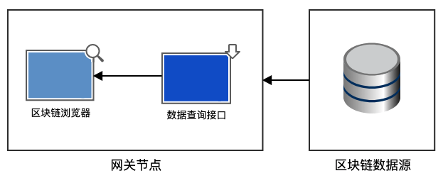
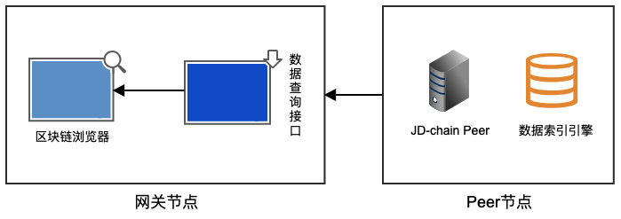
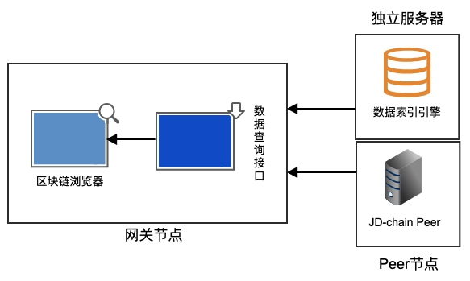

# JD-chain设计

## 一、	总体目标

## 二、	设计原则

## 三、	对象概念

## 四、	总体架构

## 五、	功能组件

## 六、	部署模型

## 七、	交易流程

## 八、	账本结构

## 九、	智能合约

## 十、	数据服务

### 10.1 为什么需要数据服务

- 数据以直观的形象化形式展现时，人的大脑处理效率最为高效
- 面对海量的数据，需要从中快速检索出所需要的数据
- 很多情况下，需要将区块链中的数据集成到现有的系统中
- 数据备份和迁移

### 10.2 数据服务的主要功能和组件

#### 10.2.1 区块链数据浏览

区块链数据浏览通过以下组件实现：
  
1. 区块链浏览器，提供数据的可视化浏览功能
2. 通用数据接口，提供基本的数据内容
3. 检索数据接口，提供区块、交易、合约、账本、用户的检索

#### 10.2.2 区块链数据的备份和迁移

- 通过区块链数据备份和迁移工具实现
- 支持将区块数据从一台服务器转移到另外一台服务器

### 10.3 区块链数据浏览服务的部署架构设计

#### 10.3.1 区块链数据浏览服务的总体部署架构设计

数据服务的总体设计架构图如图所示：

整个数据服务分为两部分，部署有区块浏览器的网关节点和区块链数据源，浏览器通过网关节点的数据查询接口访问区块链数据源。

区块链数据源分为两种模式：peer部署模式和混合部署模式，两种模式为数据查询接口提供相同的数据。

#### 10.3.2 区块链数据浏览服务的Peer部署模式架构设计

Peer部署模式架构如图所示：

其中Peer节点部署有JD-chain的Peer组件和数据索引引擎组件，两个组件在同一台服务器上为网关节点提供数据访问。

#### 10.3.3 区块链数据浏览服务的混合部署模式架构设计

混合部署模式架构如图所示：

相比于Peer部署模式，混合部署模式将数据索引引擎组件部署于独立的服务器或者集群上，和部署有JD-chain的Peer组件的Peer节点一起为网关节点提供数据访问。

## 十一、	组件化SPI